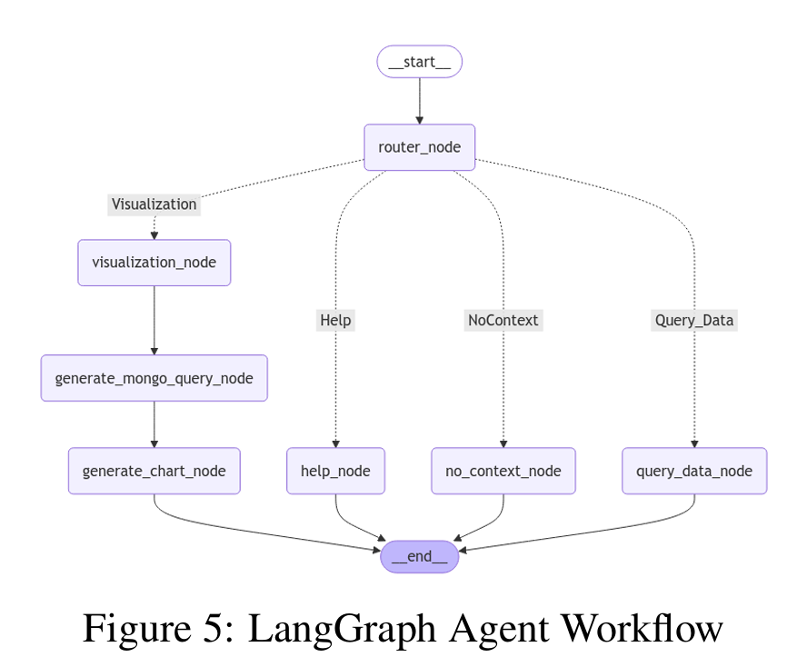
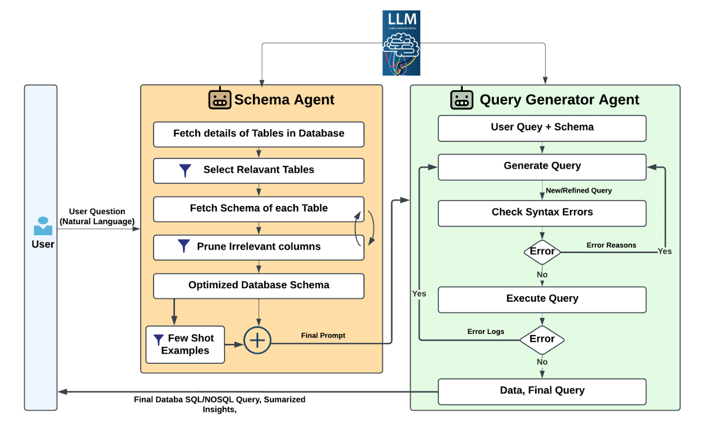
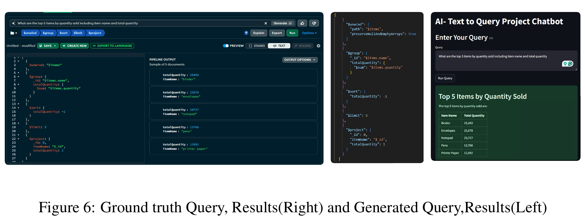
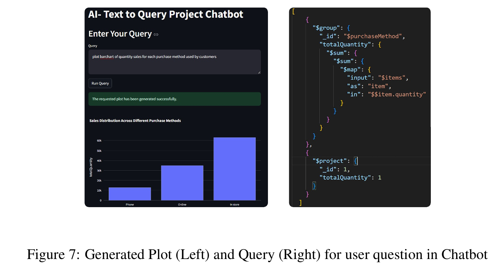

<p align="center">
  
</p>

<h1 align="center">🧠 LLM-Based Text-to-NoSQL Chatbot</h1>
<h3 align="center">Empowering non-technical users to query complex databases using natural language</h3>

<p align="center">
  <a href="https://streamlit.io"></a>
  <a href="https://www.langchain.com/"></a>
  <a href="https://www.mongodb.com/"></a>
  <a href="https://fastapi.tiangolo.com/"></a>
  <a href="https://huggingface.co/meta-llama"></a>
</p>

---

## 📌 Overview

This project presents a **multi-agent LLM-powered chatbot system** capable of translating natural language queries into efficient SQL (and NoSQL) commands. Designed for non-technical users, it simplifies data access through an intuitive interface, powered by the latest advancements in language models and schema reasoning.

> Built using LangChain, LangGraph, Streamlit, FastAPI, MongoDB, and Groq-hosted LLaMA 3.1.

---

## ⚙️ Features

- 🔍 **Natural Language to Query**: Converts user questions into executable MongoDB pipeline or SQL queries.
- 📊 **Auto Visualization**: Generates charts automatically for visual queries.
- 🧠 **Schema-aware Prompting**: Dynamically optimizes schema tokens to fit within LLM context.
- 🔁 **Error-resilient Execution**: Incorporates query validation, execution tracing, and iterative refinement.
- 💬 **Interactive Chatbot**: Built using Streamlit with real-time backend orchestration using LangGraph.

---

## 🚀 Installation & Run

1. Clone the repository:
   ```bash
   git clone https://github.com/charangajjala/ai-project.git
   cd Query_GenAI
   ```

2. Install dependencies:
   ```bash
   pip install -r requirements.txt
   ```

3. Start the backend API server:
   ```bash
   uvicorn backend.main:app --reload
   ```

4. Start the Streamlit frontend:
   ```bash
   streamlit run frontend/app.py
   ```

---

## 🧪 Architecture



- **LangGraph Agents**: Orchestrate logic for schema pruning, query generation, and error handling.
- **LLM Model**: LLaMA 3.1 (70B) via Groq API.
- **Database**: MongoDB Atlas — Sample Analytics Dataset.

---

## 🧠 System Architecture and Methodology

The system is built using a modular **multi-agent framework**, where each component is designed to handle a specific function in the Text-to-SQL pipeline. The core workflow is orchestrated using **LangGraph**, enabling dynamic decision-making through routing logic.

### 🏗️ Key Components


#### 1. Schema Agent
- Extracts and prunes relevant schema details (tables, columns, data types) based on user queries.
- Reduces token count to stay within the LLM context window.
- Provides schema-aware few-shot prompts for accurate query generation.

#### 2. Query Generator Agent
- Converts natural language to SQL/MongoDB queries using LLaMA 3.1.
- Uses iterative prompting and few-shot examples.
- Validates and re-generates queries using error feedback if execution fails.

#### 3. Visualization Agent
- Handles queries requesting plots or charts.
- Generates MongoDB queries and then Python code for plotting (e.g., bar, line charts).
- Returns visualizations rendered in real-time using Streamlit.

#### 4. LangGraph Router Node
- Acts as the decision engine.
- Routes queries to either the query execution path or the visualization path.
- Falls back to error handling if inputs are incomplete or ambiguous.

### 🔄 Methodology Overview

1. **Natural Language Input**: User submits a query via chatbot UI.
2. **Intent Detection**: LangGraph router determines whether it's a data retrieval or visualization request.
3. **Schema Optimization**: Schema Agent fetches only necessary tables/columns.
4. **Query Generation**: LLM generates SQL/MongoDB queries with in-context examples.
5. **Validation**: Syntax and execution errors are caught, refined, and re-executed.
6. **Output**: Query results or plots are returned to the user.

This design emphasizes:
- 💡 Efficient token usage (schema pruning),
- 🔁 Iterative improvement (error-aware prompting),
- 📈 Visualization-first UX (interpretable results for non-technical users),
- 🧩 Scalability across SQL and NoSQL databases.

---

## 📈 Evaluation Metrics

| Metric       | Description                                         |
|--------------|-----------------------------------------------------|
| **EM (Exact Match)** | Measures if query matches reference SQL |
| **EX (Execution Accuracy)** | Checks if result matches ground truth  |
| **VES (Valid Efficiency Score)** | Considers correctness + speed      |

> 📊 Achieved: EM = 60%, EX = 80%, VES = 74%

---

## 📸 Demo Screenshots

### 🔍 Summarized answers from user query



### 📊 Plot Generation from  user query


---

## 📚 References

1. [QueryGPT by Uber](https://www.uber.com/blog/query-gpt/)
2. [Text-to-SQL with LLMs - arXiv 2023](https://arxiv.org/abs/2304.05320)
3. [LangGraph Documentation](https://docs.langchain.com/docs/langgraph)

---

## 📜 License

This project is licensed under the MIT License.
